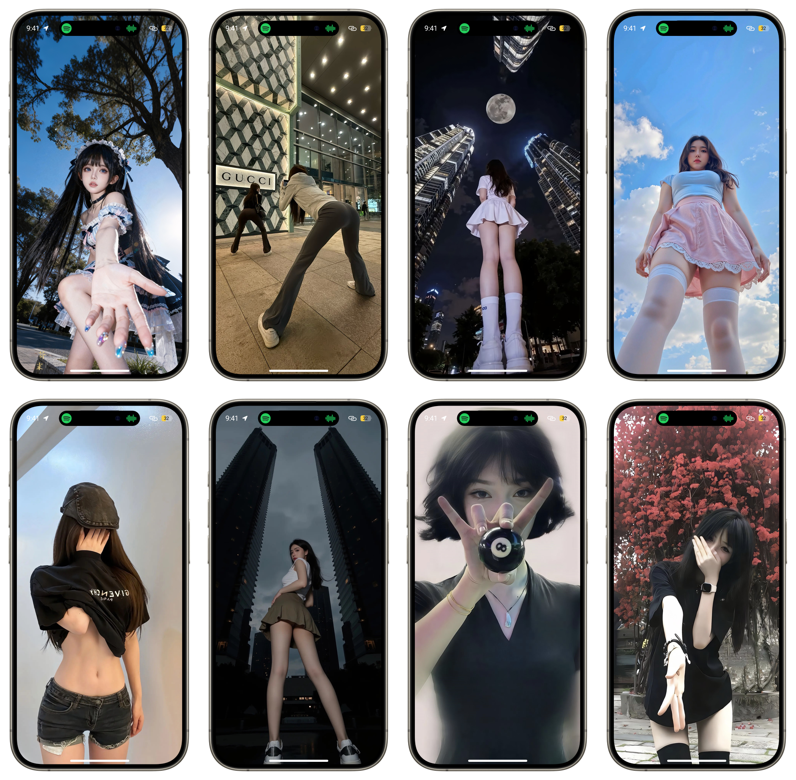
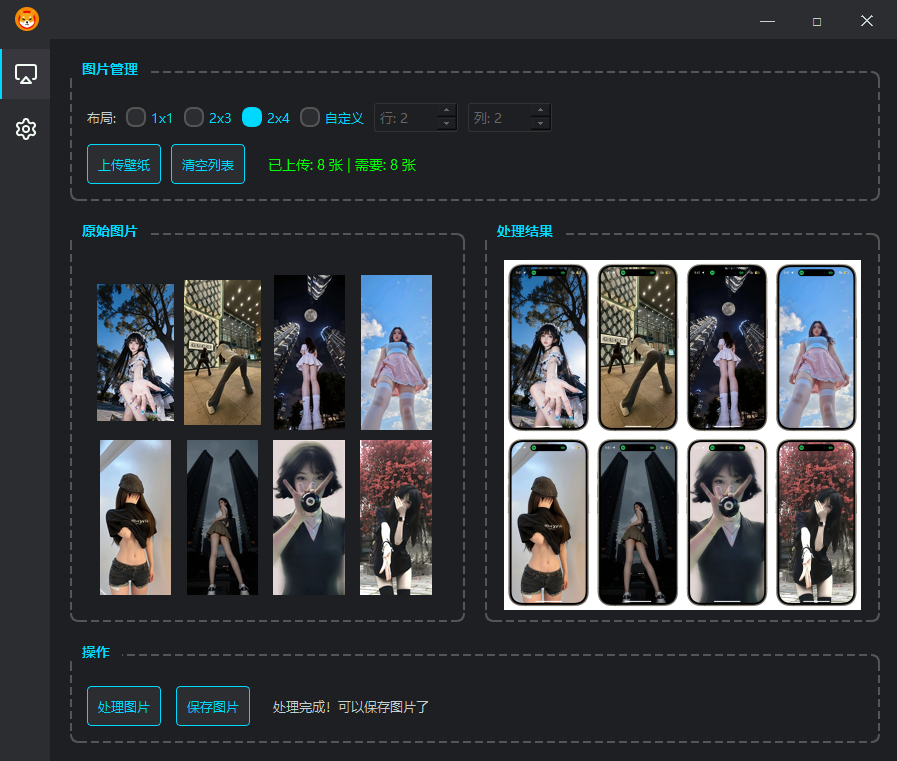
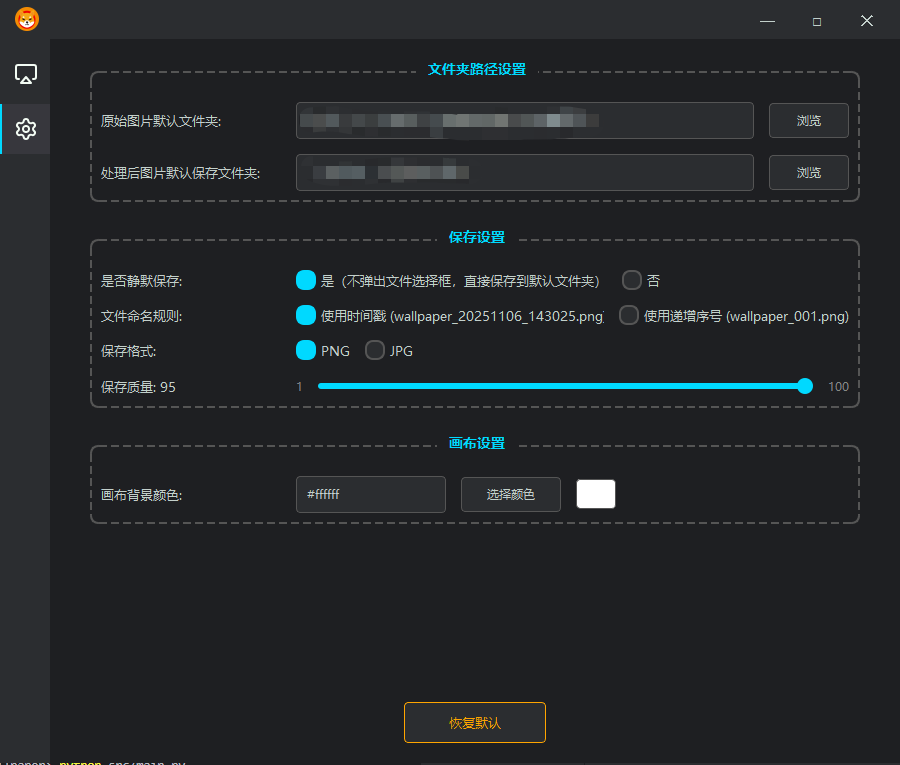

# 手机壁纸边框工具

一个跨平台的桌面应用程序，用于给壁纸图片添加手机边框效果。

## 效果展示

### 最终成品效果


## 功能特性

- 支持上传 JPG、PNG 格式的壁纸图片
- 自动等比例缩放图片至 393x852 尺寸
- 智能居中放置壁纸图片
- 添加手机边框模板覆盖
- 实时预览处理效果
- 支持保存处理后的图片

## 系统要求

- Python 3.7 或更高版本
- macOS 或 Windows 操作系统

## 安装步骤

1. 克隆或下载项目到本地

2. 安装依赖包：
```bash
pip install -r requirements.txt
```

## 使用方法

1. 运行主程序：
```bash
python src/main.py
```

2. 点击"上传壁纸图片"按钮选择图片，或直接拖拽图片到窗口

3. 点击"处理图片"按钮生成带边框的壁纸

4. 预览效果满意后，点击"保存图片"按钮保存结果

### 应用界面截图

#### 壁纸处理页面


#### 设置页面


## 项目结构

```
phone-wallpaper-frame/
├── src/                    # 源代码目录
│   ├── main.py            # 主程序入口
│   ├── ui_window.py       # GUI 界面模块
│   ├── image_processor.py # 图片处理核心逻辑
│   └── config_manager.py  # 配置管理模块
├── assets/                 # 资源文件目录
│   ├── templates/         # 模板文件
│   │   └── phone-holder.png
│   ├── icons/             # 图标文件
│   │   ├── logo.png
│   │   ├── image.png
│   │   └── settings.png
│   └── screenshots/       # 截图文件
│       ├── final-result.png
│       ├── main-page.png
│       └── settings-page.png
├── .gitignore             # Git 忽略文件配置
├── LICENSE                # MIT 许可证
├── README.md              # 项目说明
└── requirements.txt       # 依赖包列表
```

## 技术栈

- **PyQt5**: GUI 框架
- **Pillow (PIL)**: 图片处理库

## 注意事项

- 确保 `assets/templates/phone-holder.png` 模板文件存在
- 建议使用高质量的原图以获得最佳效果
- 处理后的图片会保存在用户指定的位置
- 截图文件请放置在 `assets/screenshots/` 目录下

## 许可证

本项目采用 MIT 许可证开源，详见 [LICENSE](LICENSE) 文件。

